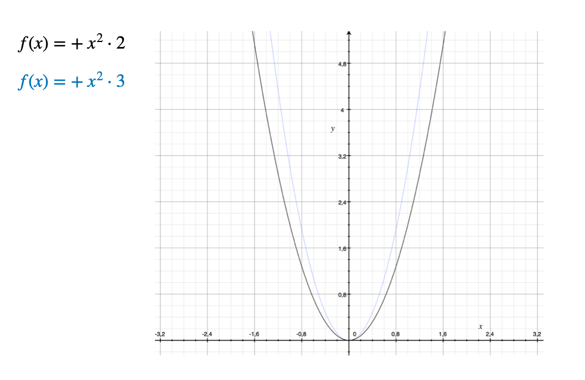

### Definición

Relacion: Correspondencia entre los elementos de dos conjuntos que forman parejas ordenadas, la formulacion de una expresión que une dos o mas objetos entre si establece una relación.

Una función queda establecida como una regla de correspondencia entre un elemento **x** de un conjutno de valores, el cual se llama dominio, que resultara en una **y** o **f(x)** de otro conjunto de valores, llamado contradominio o rango, bajo la condición que dichos conjuntos pertenezcan al conjunto de los números reales.

%2018.46.52.png){width="194"}

Si los coeficientes al ser multiplicados por las variables es 0, entonces decimos que la ecuación es incompleta.

1.  Existe la posibilidad de que dos o mas x del dominio, le corresponda el mismo valor de y o f(x) en el rango, pero no a la inversa.

2.  Para poder verificar que sea una funcion, podemos trazar en un plano cartesiano una linea vertical, si se toca en dos puntos no es una funcion, sin embargo, si solo toca un punto si es una funcion.

%2018.53.40.png){width="185"}

El dominio (x) y rango (y) de la función f(x) = 1/x

1.  El dominio son todas las x que puede tomar la función, en este caso de f(x) = 1/x

2.  Se identifica que puede tomar cualquier valor de x, excepto cuando x = 0

3.  Lo anterior porque si ponemos la variable en 0, ocurre una división que no está determinada.

4.  Por lo tanto el dominio son todos los números reales menos el 0, eso se representa como R: x != 0

Para determinar el rango suele despejarse la ecuación para expresar ahora x en función de y

$$
x = \frac{1}{y}
$$

Observamos que obtendriamos una division por cero, si $y=0$, asi que nuevamente este valor queda fuera del rango de la función. Siendo el rango de todos los números excepto y=0.

Entonces el dominio de $f(x) = x \in R:x != 0$, (!=, es igual a diferente de), y el rango es $y \in R:x != 0$.

### Gráficas de funciones.

Debemos de verificar que las funciones esten representadas explicitamente.

-   Para las funciones lineales, como su nombre lo indica, si representamos la función lineal en un plano cartesiano, podremos observar una linea.

-   Para las funciones cuadraticas, la representación en el plano cartesiano, podremos observar una parabola o curva.

{width="272"}

-   Para las funciones cubicas, la representacion en el plano cartesiano, podremos observar un trazo con diferentes curvas.

-   Para las funciones exponenciales ej: $y=e^(x/2)$, la representacion en el plano cartesiano se muestra como una linea curva sin generar un angulo de 90°.

{width="266"}

-   Para las funciones logaritmicas, la representacion en el plano cartesiano, muestra una inclinacion en la linea.

-   Para las funciones trigonometricas, la representacion en el plano cartesiano, muestra una continuidad de parabolas u ondulaciones.

### Solución de problemas

Es posible expresar gran cantidad de fenómenos a través de funciones como modelo matemático.

1.  Leer con atención el problema hasta comprenderlo.

2.  Identificar las cantidades conocidas y desconocidas, asignando simbolos para distinguirlas.

3.  Observar la relación entre estas dos cantidades.

4.  Plantear una ecuación que demuestre la relación.

5.  Verificar que la ecuación planteada corresponde a la función y aplica al 100% con los datos conocidos.

### Aplicación de funciones en problemas reales.

-   Funciones lineales.

%201.21.48.png){width="388"}

-   Funciones cuadraticas.

%201.24.45.png){width="338"}

-   Función exponencial

%201.25.47.png){width="323"}
